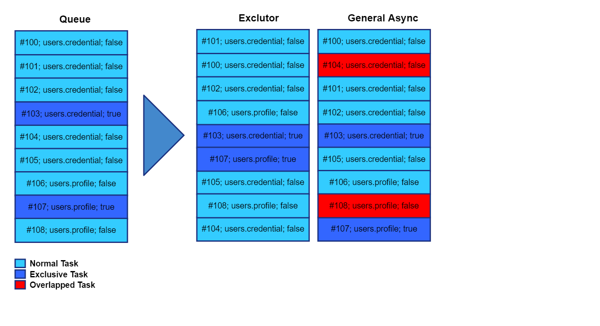

# Exclutor

Implementation of exclusive-able asynchronous process

example case:
we need multiple asynchronous process to read data from database,
but only one asynchronouse process for write data to database
and the next read process will on hold till the write process finish.



# Status


[  ](https://bintray.com/kassle/oss/exclutor/_latestVersion)
[](https://codecov.io/gh/kassle/exclutor)

## Usage:

### Adding dependency

#### maven

```
<dependencies>
    <dependency>
	<groupId>org.krybrig</groupId>
	<artifactId>exclutor-core</artifactId>
	<version>1.1.0</version>
	<type>pom</type>
    </dependency>
    <dependency>
	<groupId>org.krybrig</groupId>
	<artifactId>exclutor-rx</artifactId>
	<version>1.1.0</version>
	<type>pom</type>
    </dependency>
</dependencies>
```

#### gradle

```
compile 'org.krybrig:exclutor-core:1.1.0'
compile 'org.krybrig:exclutor-rx:1.1.0'
```

### Code

#### Java Executor

```java
String scope = "db.table.users";
Executor executor = ExclusiveExecutorFactory.create(Runtime.getRuntime().availableProcessors());
executor.execute(new AbstractExclusiveRunnable(scope, true) {
    @Override
    public void run() {
        // insert to database
    }
});
executor.execute(new AbstractExclusiveRunnable(scope, false) {
    @Override
    public void run() {
        // select from database
    }
});
```

#### Java Executor Service

```java
String scope = "db.table.users";
ExecutorService service = ExclusiveExecutorFactory.createExecutorService(Runtime.getRuntime().availableProcessors());
service.submit(new AbstractExclusiveRunnable(scope, true) {
    @Override
    public void run() {
        // insert to database
    }
});
service.submit(new AbstractExclusiveRunnable(scope, false) {
    @Override
    public void run() {
        // select from database
    }
});
```

#### RxJava2

```java
ExclusiveSchedulerFactory schedulerFactory = new ExclusiveSchedulerFactory(Runtime.getRuntime().availableProcessors());
Flowable.range(0, 100)
    .observeOn(schedulerFactory.createScheduler(scope, false))
    .doOnNext(new Consumer<Integer>() {
        @Override
        public void accept(Integer index) throws Exception {
            // select from db
        }
    })
    .observeOn(schedulerFactory.createScheduler(scope, true))
    .doOnNext(new Consumer<Integer>() {
        @Override
        public void accept(Integer index) throws Exception {
            // insert to db
        }
    })
    .subscribe();
```

### Build

```
mvn compile
mvn package
mvn install
```
